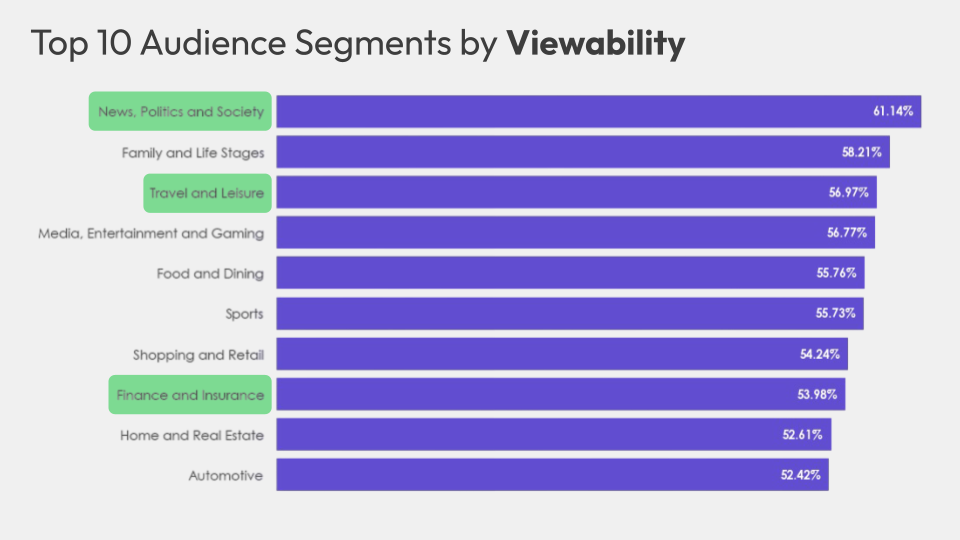
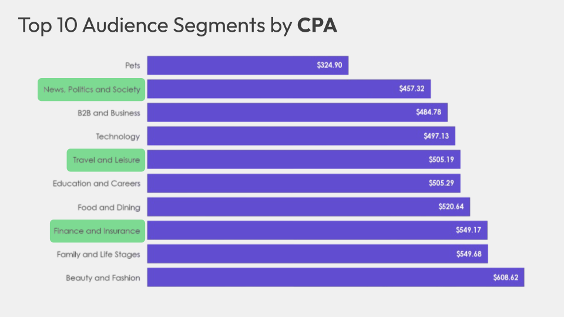
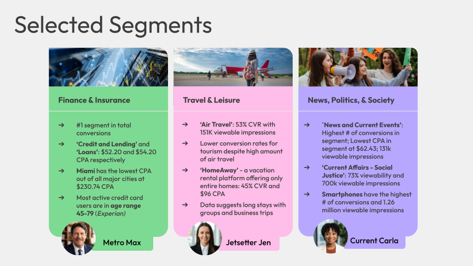
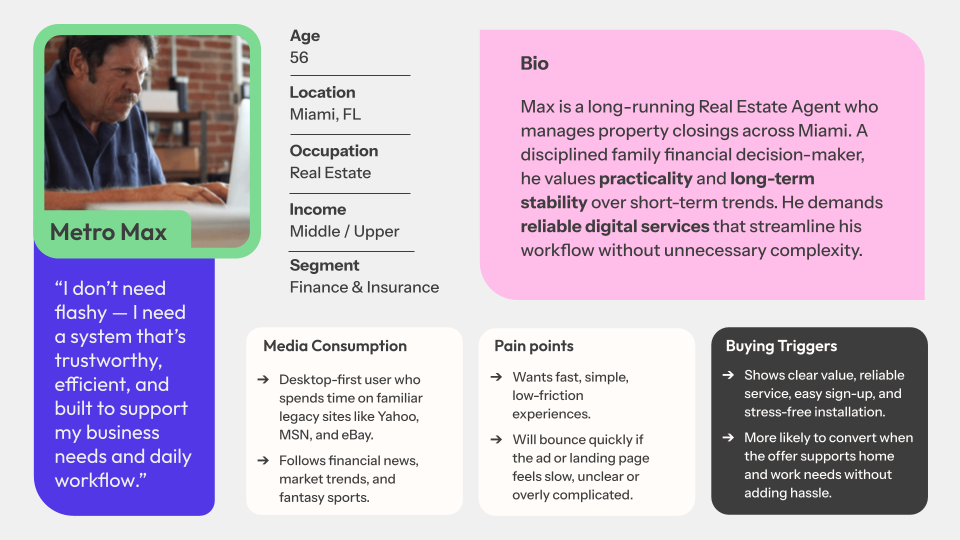
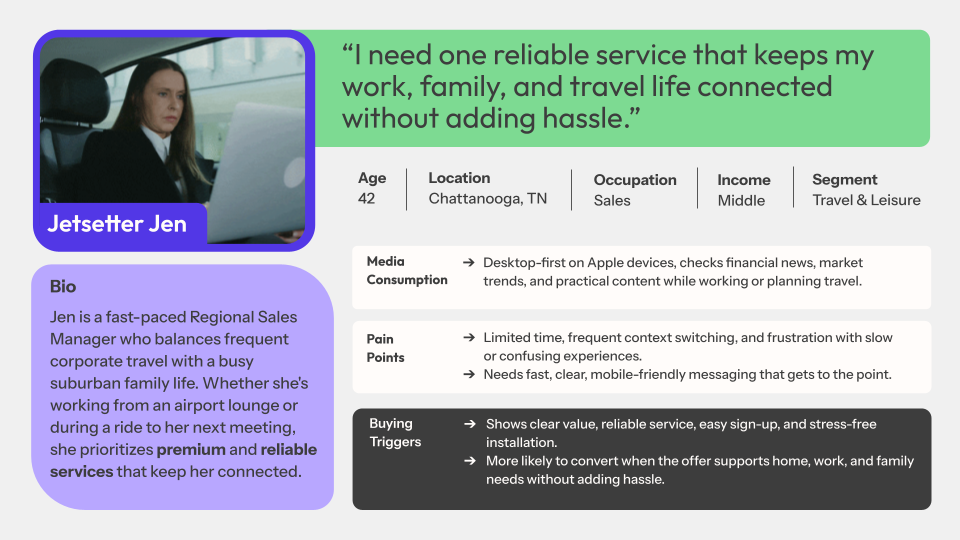
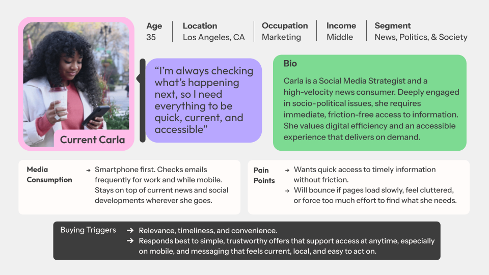

# Telecom-Media-Campaign-Audience-Analysis
Audience analysis of a telecom media campaign using Python. Built a custom segment classifier to categorize 727 ad records into 19 audience types and computed KPIs (CTR, CVR, CPA, viewability) using pandas and seaborn. Includes 3 data-backed audience personas validated with external sources (Experian, SimilarWeb).

## Telecom Media Campaign Audience Analysis

### Purpose
This project analyzes historical media campaign data for a telecommunications client to identify cost-effective audience segments and inform future ad spend strategy. The analysis was completed as part of a cross-functional data analytics team, with this repository covering the audience analyst role.

### Objective
Process and evaluate 727 ad campaign records across audience segments, devices, and publisher sites to identify top-performing audiences relative to client KPI goals — including a $250 CPA threshold and 0.015% CTR benchmark — and develop actionable audience personas to guide targeting strategy.

### Findings
- **Finance & Insurance** was the top-converting segment with 1,160 total conversions. Credit & Lending and Loans subcategories achieved CPAs of $52.20 and $54.20 respectively — well below the $250 client goal.
- **Beauty & Fashion** led all segments in conversion rate at 15.54%, followed by Travel & Leisure at 14.36%.
- **News, Politics & Society** produced the lowest CPA within its segment at $62.43 with strong viewability (73.71%) and 131K viewable impressions.
- Miami emerged as the most cost-efficient major market for Finance audiences at $230.74 CPA.

### Recommendations
Three segments are recommended for prioritized budget allocation:
- **Finance & Insurance** — Scale investment toward Credit & Lending and Loans audiences, targeting major metros with Miami as the most cost-efficient entry point.
- **Travel & Leisure** — Direct spend toward long-stay and business travel placements, where Air Travel drove a 53% CVR and HomeAway delivered 45% CVR at $96 CPA.
- **News, Politics & Society** — Maintain investment in trusted news portals such as mail.yahoo.com and nbcnews.com, where viewable impressions and CPA performance consistently met or beat client goals.

## Visualizations

